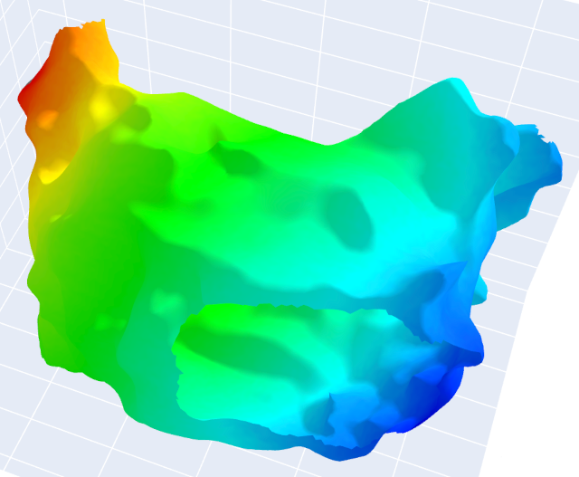
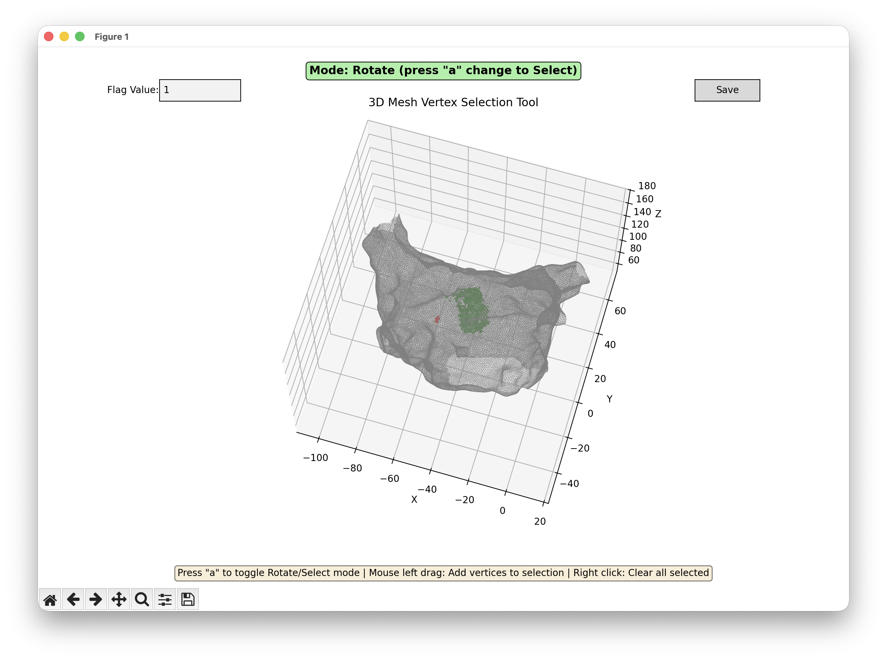

This is an electrophysiological heart simulator based on Mitchell-Schaeffer equations. Written in Python. It can reproduce patient-specific arrhythmias.  

An example of arrhythmia simulation:  
<!--    -->
  

Examples of simulated action potential:  
  

Examples of simulated electrogram:  
  

Example of a local activation time map:  
  

A user interface for assigning vertex flag  
  
