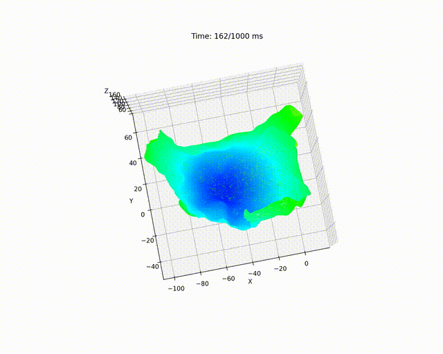
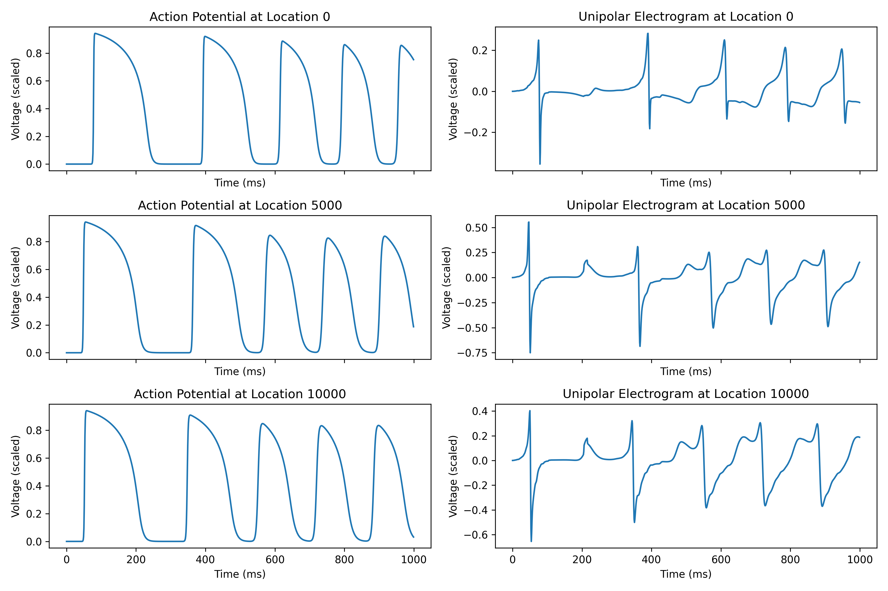

# Introduction
This is an electrophysiological heart simulator capable of modeling patient-specific focal and rotor arrhythmias. It computes action potentials and electrograms and is implemented in Python.

# Instructions
- This code had been tested in MacOS and Ubuntu.
- Use software "Visual Studio Code" to run this code.
- Edit the "settings.json" file inside the hidden folder ".vscode" to your defaultInterpreterPath.
- Run main.py for simulation.
- Run display_simulation_results.py for visualizing the heart simulation

# Python dependencies
- pip install numpy
- pip install matplotlib 
- pip install scipy
- pip install numba

# Examples
An example of arrhythmia simulation:  
  

Examples of simulated action potential and electrogram:  
  
